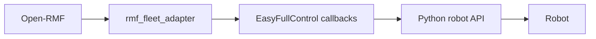
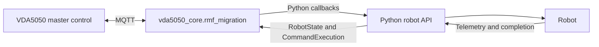

# Migrating an Open-RMF Fleet Adapter to VDA5050 using Python Bindings

This guide explains how to migrate an existing Open-RMF fleet adapter written against `rmf_fleet_adapter`'s **EasyFullControl** Python API so that it talks to a VDA5050 master control instead of Open-RMF.

`vda5050_core.rmf_migration` is deliberately modeled on EasyFullControl: `RobotState`, `RobotConfiguration`, `RobotCallbacks`, `CommandExecution`, `Destination`, `ActivityIdentifier`, `FleetConfiguration`, `FleetUpdateHandle`, `RobotUpdateHandle`, and `Adapter` all keep the same names and shapes. For an EasyFullControl-based integration, migrating is largely a seamless import swap:

```python
# Before
from rmf_fleet_adapter.easy_full_control import (
    Adapter,
    FleetConfiguration,
    RobotState,
    RobotConfiguration,
    RobotCallbacks,
)

# After
from vda5050_core.rmf_migration import (
    Adapter,
    FleetConfiguration,
    RobotState,
    RobotConfiguration,
    RobotCallbacks,
)
```

Your robot-facing code — vendor SDK calls, ROS 2 topics/services/actions, REST/gRPC clients, telemetry polling, completion detection — has nothing to do with Open-RMF and carries over unchanged into the `navigate`, `stop`, `action_executor`, and optional `localize` callbacks.

What does need to change:

- `Adapter.make()` takes no node name here.
- Fleets are added with `adapter.add_vda5050_fleet(fleet_config)` instead of an Open-RMF `add_fleet(...)`.
- `FleetConfiguration` takes an MQTT `broker_uri` and `client_id_prefix` instead of an Open-RMF nav-graph/config-file path.
- `stop` and `action_executor` have slightly different signatures than their Open-RMF counterparts — see [§7](#7-register-robot-callbacks).


## Table of Contents

1. [Architecture Change](#1-architecture-change)
2. [The Reference Example](#2-the-reference-example)
3. [Build the Fleet and Robot Configuration](#3-build-the-fleet-and-robot-configuration)
4. [Create the Adapter, Fleet, and Robot](#4-create-the-adapter-fleet-and-robot)
5. [Register Robot Callbacks](#5-register-robot-callbacks)
6. [Handle Navigation Requests](#6-handle-navigation-requests)
7. [Handle Stop Requests](#7-handle-stop-requests)
8. [Handle Robot Actions](#8-handle-robot-actions)
9. [Handle Localization](#9-handle-localization)
10. [Publish Robot State](#10-publish-robot-state)
11. [Coordinate Frames](#11-coordinate-frames)
12. [Thread Safety](#12-thread-safety)
13. [Start and Stop the Adapter](#13-start-and-stop-the-adapter)
14. [Build and Run](#14-build-and-run)
15. [Test the Migration](#15-test-the-migration)
16. [Migration Summary](#16-migration-summary)
17. [Experimental Limitations](#17-experimental-limitations)


## 1. Architecture Change

A typical Open-RMF integration is structured as:



After migration:



`Fleet[rmf_fleet_adapter]` is removed, along with everything upstream of it — traffic scheduling, negotiation, task allocation, door/lift coordination, and fleet-level planning must now come from the VDA5050 master control or another external system. `API[Python robot API]` is the part that survives unchanged; only the layer above it, which dispatches commands and publishes state changes, is replaced.

## 2. The Reference Example

```
vda5050_core/examples/python/rmf_migration_client_example.py
```

This single script is the shape a migrated adapter takes. There is no `config.yaml` or separate robot-API module — configuration is built directly in Python from environment variables, and the callbacks are defined inline:

```python
from vda5050_core.rmf_migration import (
    Adapter,
    FleetConfiguration,
    RobotCallbacks,
    RobotConfiguration,
    RobotState,
)

adapter = Adapter.make()
fleet_config = FleetConfiguration(
    fleet_name="demo",
    broker_uri=BROKER_URI,
    client_id_prefix=MQTT_CLIENT_ID,
)
fleet = adapter.add_vda5050_fleet(fleet_config)

robot_config = RobotConfiguration(
    manufacturer=MANUFACTURER,
    serial_number=SERIAL_NUMBER,
    interface_name="uagv",
    version="2.0.0",
)
initial_state = RobotState(MAP_ID, [0.0, 0.0, 0.0], 1.0)

def navigate(destination, execution) -> None:
    ...

def stop(identifier) -> None:
    ...

def execute_action(action_type, action_id, execution) -> None:
    ...

callbacks = RobotCallbacks(navigate, stop, execute_action)
robot_handle = fleet.add_robot("robot-1", initial_state, robot_config, callbacks)

adapter.start()
```

For your migration, replace the callback bodies with your existing Open-RMF robot-facing logic, and source `BROKER_URI`, `MQTT_CLIENT_ID`, `MANUFACTURER`, `SERIAL_NUMBER`, and `MAP_ID` however you like — launch parameters and environment variables both work today.

> [!NOTE]
> Porting an existing Open-RMF `config.yaml` is not supported yet. `FleetConfiguration.from_config_files()` is unimplemented — build config directly in Python as shown above.

## 3. Build the Fleet and Robot Configuration

```python
FleetConfiguration(fleet_name, broker_uri, client_id_prefix, update_interval=30)
```

- `fleet_name` is the fleet name used by the adapter.
- `broker_uri` is the VDA5050 MQTT broker address.
- `client_id_prefix` is used to generate MQTT client IDs; it must be unique per adapter instance when multiple adapters share a broker.
- `update_interval` is the maximum VDA5050 state heartbeat interval in seconds (default `30`).

```python
RobotConfiguration(manufacturer, serial_number, interface_name="uagv", version="2.0.0")
```

- `manufacturer` is the VDA5050 manufacturer identity.
- `serial_number` uniquely identifies the robot.
- `interface_name` is normally `uagv`.
- `version` is the VDA5050 protocol version used in the MQTT topic.
- `factsheet` (optional) — not covered here; see [Client Adapter](client-adapter.md).

These values form topics such as:

```
uagv/v2/Manufacturer/S001/order
uagv/v2/Manufacturer/S001/instantActions
uagv/v2/Manufacturer/S001/state
uagv/v2/Manufacturer/S001/connection
```

The manufacturer and serial number must match the values used by the VDA5050 master control.

```python
RobotState(map, [x, y, theta], battery_soc)
```

This is the state used when the robot is first registered, and again whenever you publish an update (see [§10](#10-publish-robot-state)). The map name and coordinate frame must match the map used by the VDA5050 master control.

## 4. Create the Adapter, Fleet, and Robot

```python
adapter = Adapter.make()
fleet_handle = adapter.add_vda5050_fleet(fleet_config)
robot_handle = fleet_handle.add_robot(
    robot_name,
    initial_state,
    robot_config,
    callbacks,
)
```

Arguments are positional. `add_robot` returns a `RobotUpdateHandle`, used later to publish state (see [§10](#10-publish-robot-state)).

`add_robot` is also where callbacks are wired up internally — in particular, whether `localize` was set on `callbacks` before this call determines whether the adapter registers a localization handler at all. Set `callbacks.localize` before calling `add_robot`, not after.

## 5. Register Robot Callbacks

```python
callbacks = RobotCallbacks(navigate, stop, action_executor)
callbacks.localize = localize  # optional
```

The required callback signatures:

| Callback         | Signature                                  | Notes |
| ----------------- | ------------------------------------------- | ----- |
| `navigate`         | `(destination: Destination, execution: CommandExecution) -> None` | See [§6](#6-handle-navigation-requests). |
| `stop`              | `(identifier: ActivityIdentifier) -> None`  | Takes an identifier, not a robot name — see [§7](#7-handle-stop-requests). Different from EasyFullControl's `stop()`. |
| `action_executor`   | `(action_type: str, parameters: dict, execution: CommandExecution) -> None` | `parameters` is the VDA5050 action's parameters as a JSON-decoded dict (`{}` when empty) — not an `action_id` string. Different from EasyFullControl's action callback. |
| `localize`          | `(destination: Destination, execution: CommandExecution) -> None` | Optional. Same shape as `navigate`. |

If your existing EasyFullControl callbacks used different parameter names for `stop` or the action callback, only the body needs porting — adjust the signature to match the table above.

## 6. Handle Navigation Requests

```python
def navigate(destination, execution) -> None:
    ok = robot_api.send_goal(destination.xy, destination.yaw, destination.map)
    if not ok:
        execution.failed("Robot rejected navigation goal")
        return
    pending[robot_name] = execution
```

`destination` provides:

- `destination.map`
- `destination.position` — complete `[x, y, yaw]`
- `destination.xy` — target `x, y`
- `destination.yaw`
- `destination.graph_index` — optional, the VDA5050 node's sequence ID
- `destination.name` — optional, the VDA5050 node ID
- `destination.speed_limit` — optional

`navigate()` should submit the command and return without waiting for the robot to arrive. Store the `execution` handle and call `execution.finished()` from your own telemetry/completion-detection code only once the robot has physically arrived — the same pattern your EasyFullControl adapter already used for `follow_new_path`. If the robot rejects the command, call `execution.failed(reason)` instead.

`CommandExecution` provides:

- `finished()`
- `failed(reason: str)`
- `okay() -> bool`
- `is_finished() -> bool`
- `identifier` (read-only property, an `ActivityIdentifier`)

## 7. Handle Stop Requests

```python
def stop(identifier) -> None:
    robot_api.pause()
```

This callback fires when the VDA5050 master sends a `startPause` instant action. It receives the `ActivityIdentifier` of that pause action — not a robot name, and not a `CommandExecution`. The adapter marks the pause action finished immediately after calling `stop()`; there is no way to report a pause failure back through this callback. If pausing can fail, surface that through your next state update (for example, the `errors` list via `robot_handle.more()`) instead.

This is a real behavior difference from EasyFullControl's `stop()`, which is typically called with no arguments and tied to an explicit RMF cancellation, not a VDA5050 `startPause` action.

Do not depend on this callback as an emergency-stop mechanism — safety-critical stopping must be handled by the robot's own safety system.

## 8. Handle Robot Actions

```python
def execute_action(action_type, parameters, execution) -> None:
    ok = robot_api.start_activity(action_type, parameters)
    if not ok:
        execution.failed(f"Robot rejected action: {action_type}")
        return
    execution.finished()
```

`action_type` is the VDA5050 action type (for example `pick`, `drop`, `dock`, `charge`, `wait`). `parameters` is the action's parameters decoded from JSON into a Python dict — port the body of your existing EasyFullControl `PerformAction` handler here, reading whichever parameter keys it used to read.

For a long-running action, store the `execution` handle and call `finished()` only when the robot confirms completion, instead of immediately after dispatching — the same pattern used for navigation.

## 9. Handle Localization

```python
def localize(destination, execution) -> None:
    ok = robot_api.set_initial_pose(destination.position, destination.map)
    if not ok:
        execution.failed("Robot rejected the localization request")
        return
    execution.finished()
```

Fires on an `initPosition` request. Same shape as `navigate` — a `Destination` and a `CommandExecution`. Assign it to `callbacks.localize` before calling `add_robot` (see [§4](#4-create-the-adapter-fleet-and-robot)); omit it entirely when the robot localizes independently.

## 10. Publish Robot State

```python
state = RobotState(current_map, current_position, current_battery_soc)
robot_handle.update(state, execution.identifier)
robot_handle.more().set_driving(is_moving)
```

`update()` reports map, position, and battery state of charge to the VDA5050 state message. `more()` returns a `StateManager` for everything else — `set_driving`, `add_error`, `set_action_states`, `set_operating_mode`, and more (see [Client Adapter](client-adapter.md)).

The `identifier` argument to `update()` is accepted for shape-compatibility with EasyFullControl but is not currently used internally — it does not yet correlate a state update with a specific command. `ActivityIdentifier` also has no public constructor in Python; the only way to obtain one is `execution.identifier` from a `CommandExecution` you've already received. If you need something to pass and have no current execution on hand, reuse the last identifier you received rather than trying to construct a fresh one.

## 11. Coordinate Frames

The robot coordinate frame and the VDA5050 map coordinate frame must agree. Confirm both systems use consistent map IDs, x/y coordinates, orientation conventions, distance units, and angle units — the same check your Open-RMF integration already had to make against the Open-RMF traffic map, now against the VDA5050 master control's map instead.

If the robot uses a different coordinate frame, convert at the callback boundary and keep the transformation in one place so navigation commands and reported state never disagree:

```python
def to_robot_frame(x, y, theta):
    return (x - OFFSET_X) / SCALE, (y - OFFSET_Y) / SCALE, theta - ROTATION

def to_vda5050_frame(x, y, theta):
    return x * SCALE + OFFSET_X, y * SCALE + OFFSET_Y, theta + ROTATION
```

## 12. Thread Safety

Callbacks are invoked from C++ worker threads while any polling/telemetry loop you run stays on its own thread. Guard shared state — active execution handles, cached telemetry, connection state — with a lock:

```python
with self._lock:
    self.execution = execution
```

Avoid holding the lock while performing a slow REST request or waiting on a robot response.

## 13. Start and Stop the Adapter

Register all fleets, robots, and callbacks before starting:

```python
adapter.start()
```

```python
adapter.stop()
```

Stop the adapter cleanly on `SIGINT`/`SIGTERM`, the same as your Open-RMF adapter's shutdown path.

## 14. Build and Run

Build the package (Python bindings are on by default):

```
colcon build --packages-select vda5050_core --cmake-args -DBUILD_EXAMPLES=ON
source install/setup.bash
```

Confirm the module imports:

```
python3 -c "from vda5050_core.rmf_migration import Adapter"
```

Start a local broker:

```
mosquitto -v -p 1883
```

Run the example directly with Python (there is no `ros2 run` entry point for it):

```
python3 vda5050_core/examples/python/rmf_migration_client_example.py
```

Dispatch a test order against it using the packaged C++ order publisher, which defaults to the same `Manufacturer`/`S001` identity as the example:

```
ros2 run vda5050_core order_publisher
```

Monitor all robot topics:

```
mosquitto_sub -t 'uagv/v2/Manufacturer/S001/#' -v
```

## 15. Test the Migration

- The module imports and the adapter connects to the broker.
- The robot registers and the expected topics appear on the broker.
- A VDA5050 order reaches `navigate()`; the callback returns without blocking, and `execution.finished()` is only called after physical arrival.
- An `initPosition` request reaches `localize()`, if implemented.
- A `startPause` instant action reaches `stop()`.
- Instant actions reach `execute_action()` with the expected `action_type` and `parameters`.
- State updates publish map, position, and battery correctly; driving state toggles with movement.
- `SIGINT`/`SIGTERM` stop the adapter and close the MQTT connection cleanly.

## 16. Migration Summary

1. Swap the import from `rmf_fleet_adapter.easy_full_control` to `vda5050_core.rmf_migration`.
2. Replace Open-RMF fleet/nav-graph configuration with a `FleetConfiguration` built from MQTT broker details, and a `RobotConfiguration` built from VDA5050 manufacturer/serial identity.
3. Keep your existing robot-facing code; move it into `navigate`, `stop`, `action_executor`, and optional `localize`, adjusting only the signatures noted in [§5](#5-register-robot-callbacks).
4. Report navigation and action completion only after physical confirmation, same as before.
5. Re-verify coordinate frames and map names against the VDA5050 master control.
6. Test the full MQTT command and state flow end to end.

## 17. Experimental Limitations

The Python migration API is experimental:

- `FleetConfiguration.from_config_files()` is unimplemented and always returns nothing.
- The `identifier` argument to `RobotUpdateHandle.update()` is accepted but not yet used to correlate state with a specific command.
- `stop()` is only invoked for VDA5050 `startPause` instant actions, and its result cannot be reported back through the callback.

For detailed adapter usage, see [Client Adapter](client-adapter.md).
